# REST Features Sample

This sample demonstrates some of the REST features present in the FLOGO ReceiveHTTPMessage trigger and InvokeRestService activity. Features which are covered in these sample apps are:
## ReceiveHTTPMessage trigger
1. ReceiveHTTPMessage trigger is configured with API spec imported under the Specs tab. 
2. API Spec has Path, query and header parameters which get auto-populated in the REST trigger.
3. Multiple response code in REST trigger.
4. Response Headers in REST trigger.
5. App Schema in Request Schema and mapper activities.
6. Multiple branching for each Response code.
7. ConfigureHTTPResponse activity to map corresponding response schema and header with Return activity.

## InvokeRestService activity
1. Configuring InvokeRest activity with the API Spec of the producer REST service.
2. Path, query, header parameters and Request and Response schema will be auto-populated.
3. Branching with condition on the Response code received from the invoked service.
4. App property for the URL field which can be overridden at runtime as per the request URL. 

## Import the sample apps in the Workspace
 
1. Download the sample's .flogo files 'flogo.rest.service.flogo' and 'Invoke.flogo.rest.service.flogo' or clone the repo and click on these files, apps for producer and consumer services respectively.

2. Open the Workspace in the Visual Studio Code and click on the 'flogo.rest.service.flogo' file under the Explorer. 
 

3. Click on the 'postBookDetails' flow to see the flow implementation.

4. API Spec file used in the Rest trigger is imported along with the app. This API spec was imported under the Specs tab from the local disk.

5. After importing the 'flogo.rest.service' app(producer service), repeat the above steps to import and open the Invoke.flogo.rest.service app(consumer service).

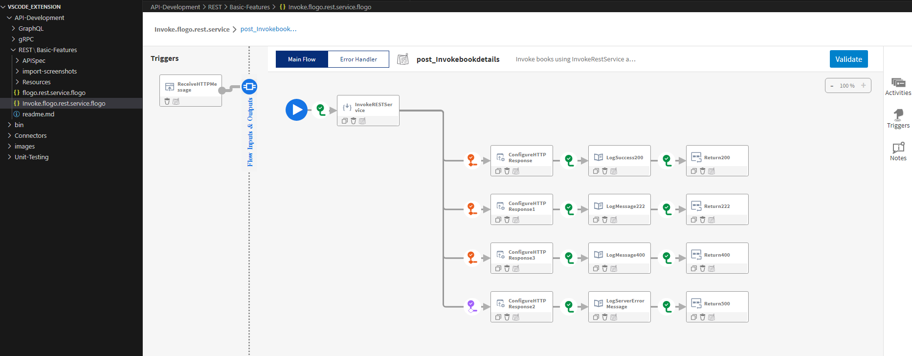

## Understanding the configuration
In the 'flogo.rest.service', App level Spec is attached in Trigger Settings "Configure Using API Specs" setting to true and clicking the "Use app level spec" toggle. This API spec was uploaded Under the Specs tab. When A RecevieHTTPMessage trigger is configured with an API spec path, query and header parameters are auto-populated. We can see that multiple response codes have also been auto-populated in the Rest trigger. Few Response codes have Response headers as well.
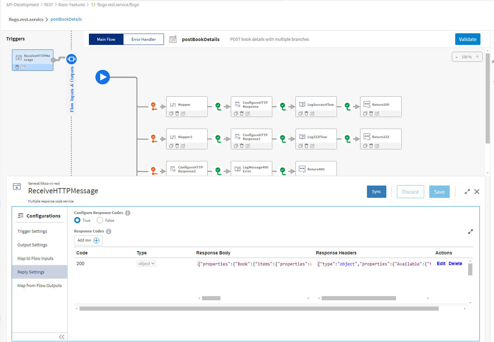

For each response code we are returning a different response for that we're using branching and conditions have been put, when these conditions are satisfied that particular branch gets executed and that response is returned. Like here for 200 Success response the condition is that the book array should contain more than 2 objects but less than or equal to 10 objects, the count of the array object is taken from the payload passed in the input.
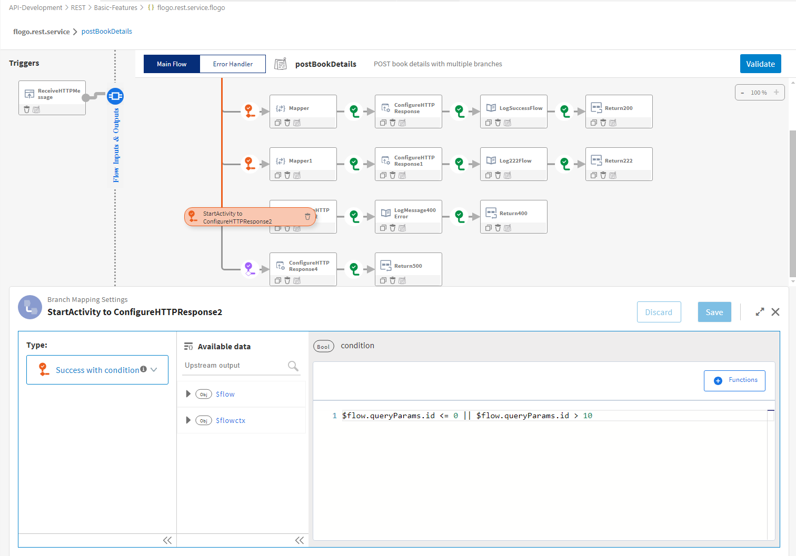

Similarly, for Error 400 response we have a condition that query parameter 'id' should not be between 0 to 10. If 'id' is negative or greater than 10 integer value then 400 error will be returned.

App level schema is used here in the app in the mapper activity. We can have a common schema declared in the 'Schema' section and use it throughout the app wherever it is supported. The advantage of App level schema is that editing the app level schema will modify the schema wherever it is used, also we do not need to enter the same schema everywhere.
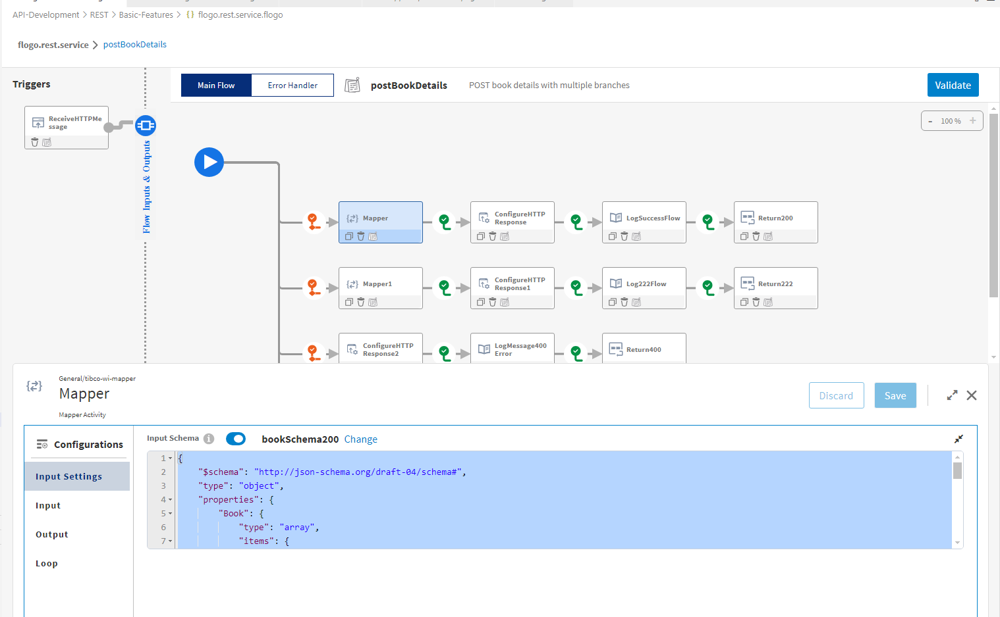

ConfigureHTTPResponse activity should be used when we have configured multiple response codes in the Rest trigger. This activity is useful in mapping Response body and Response headers of a particular Response code in getting input from other activities and output to 'Return' activity.
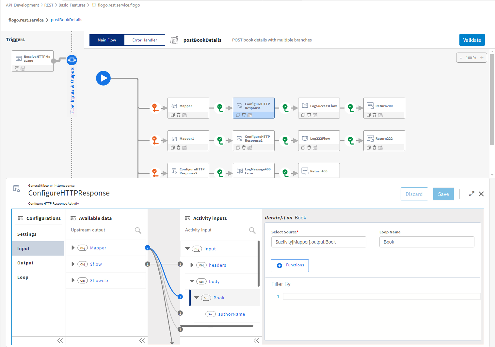

For the 'Invoke.flogo.rest.service' app, we have configured the activity with the API Spec of the 'flogo.rest.service'. We can upload swagger 2.0 or Open API spec 3.0 in the InvokeRestService activity to configure it. Request parameters, Request schema, Response schema and header would be auto-populated when a valid API spec file is uploaded. After uploading the spec we just need to map the input.
App property is attached with the Invoke Rest activity URL field which can be overridden at runtime as per the URL of the service to be invoked without changing the app.
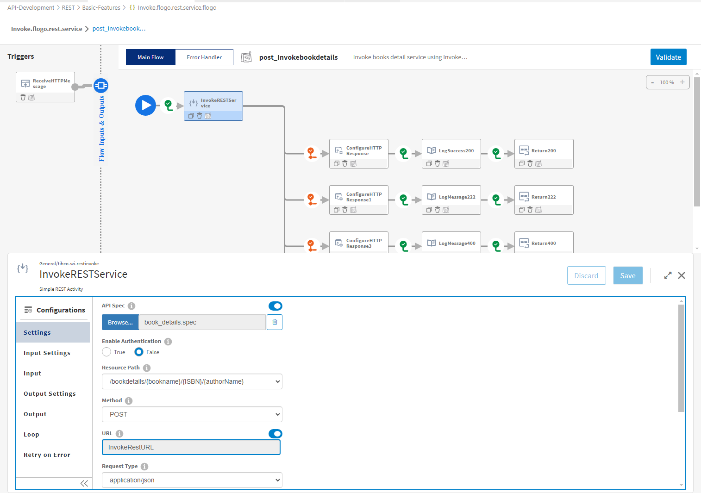

In the 'Invoke.flogo.rest.service' we have similar branching like the service app, but here the condition is based on the response code received when the service is invoked, like for 200 response the success branch will be executed and corresponding response will be returned.
As the consumer app is also a multiple response code service ConfigureHTTPResponse activity is used for mapping input and output.
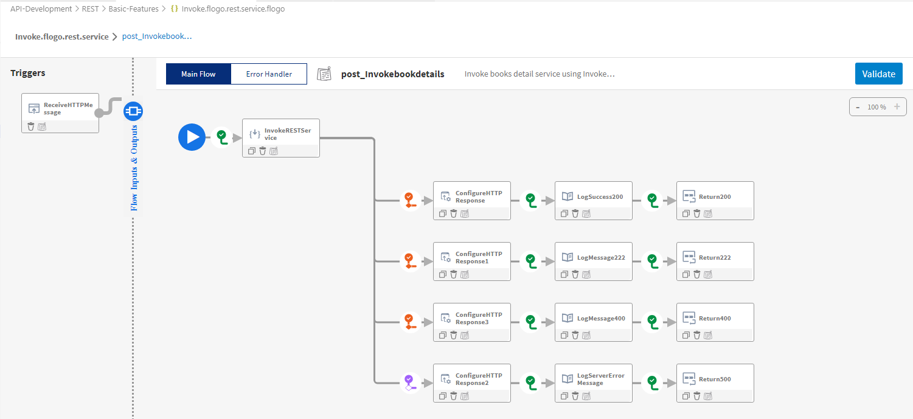

## Run the application

After copying both the apps in the workspace, create app executable binaries for both the apps to test them locally. Executable can be created based on the OS and architecture where the app will be executed. For creating binaries for testing in local environment create a "Local Runtime" first.

Now, run the 'flogo.rest.service' app first. Export the URL of the Service app in the 'Invoke.flogo.rest.service' app before running the invoking app like this:

 $ ./flogo.rest.service 

 $ export InvokeRestURL="http://localhost:9998"

 $ FLOGO_APP_PROPS_ENV=auto ./Invoke.flogo.rest.service 

And then hit the endpoint of the 'Invoke.flogo.rest.service' app using CURL or any Rest Client application.

## Output

1. Sample response for 200 Success 
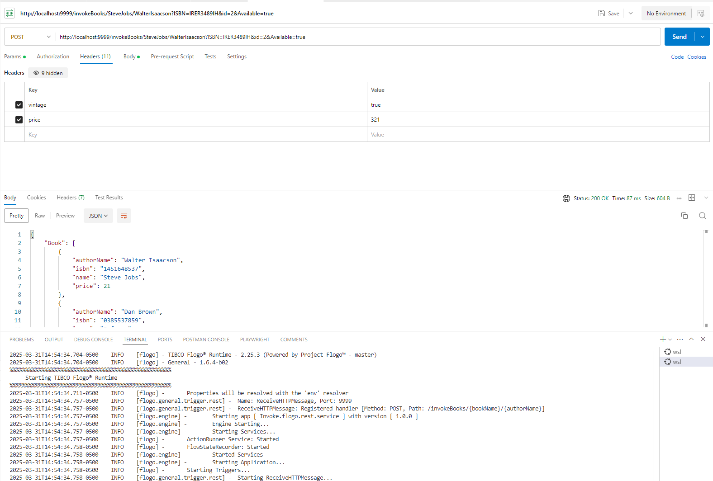

2. Sample response for 222 custom code 
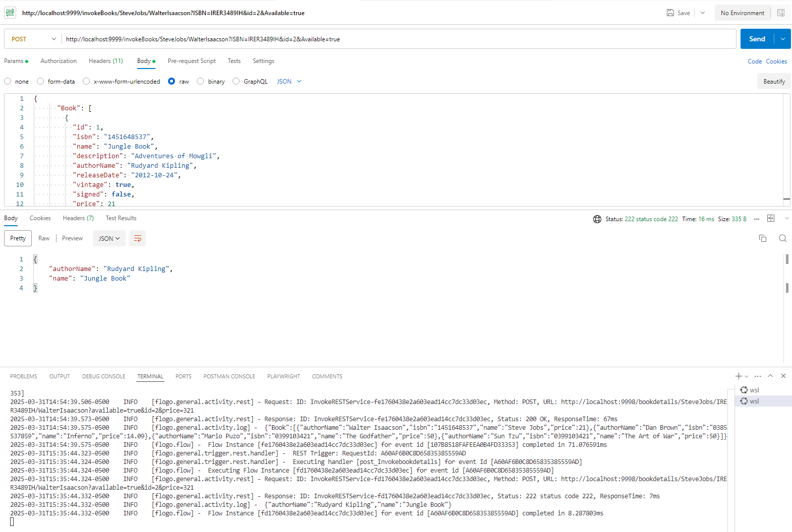

3. Sample response for 400 error
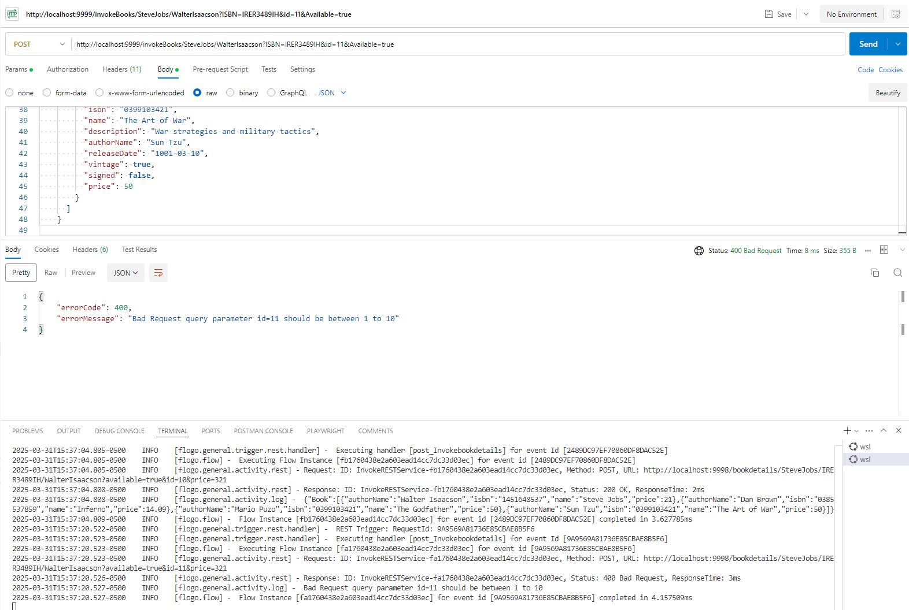

4. Sample response for 500 error
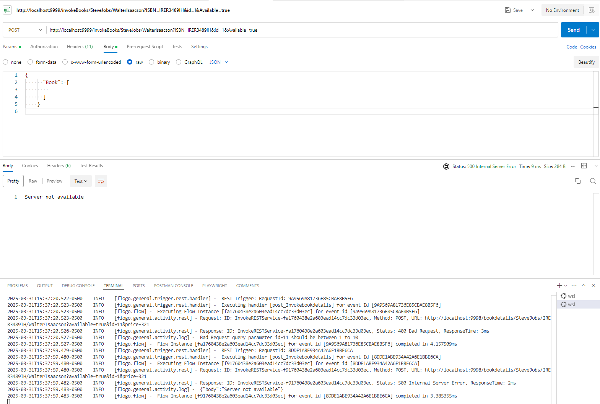

## Troubleshooting

1. Start the producer service 'flogo.rest.service' app first and then start the consumer service'Invoke.flogo.rest.service'.
2. The responses are received upon meeting a particular condition, please check the branch conditions.
3. If the 'Invoke.flogo.rest.service' app is not returning the expected response, please check if the 'InvokeRestURL' application property is pointing to the right endpoint URL.
4. For expected payload and parameters, please refer to the Resources folder.

## Help

Please visit our [TIBCO Flogo&trade; Extension for Visual Studio Code documentation](https://docs.tibco.com/products/tibco-flogo-extension-for-visual-studio-code-latest) for additional information.
