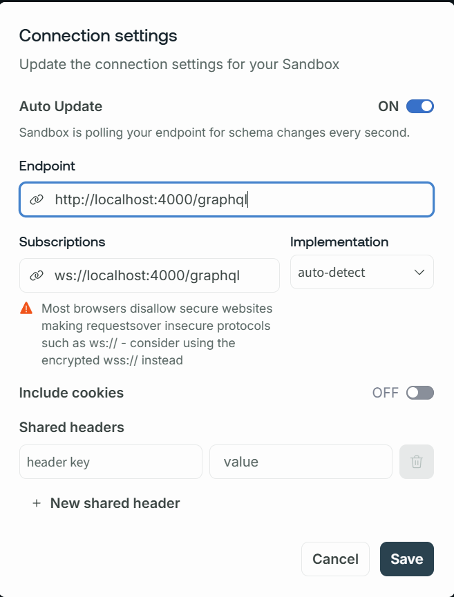
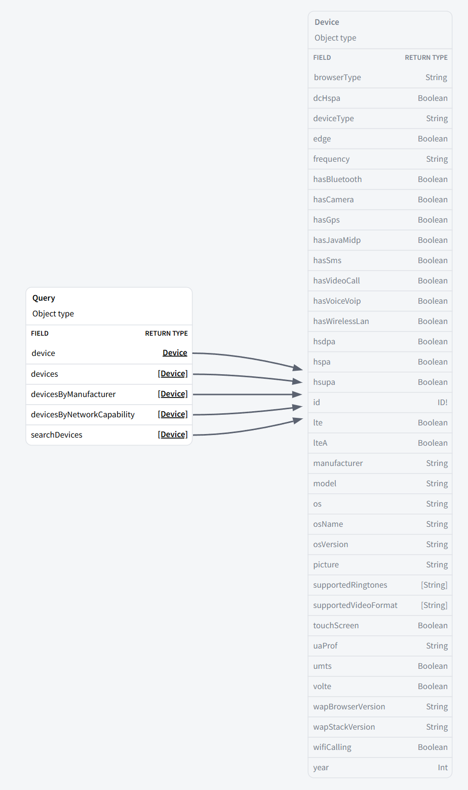
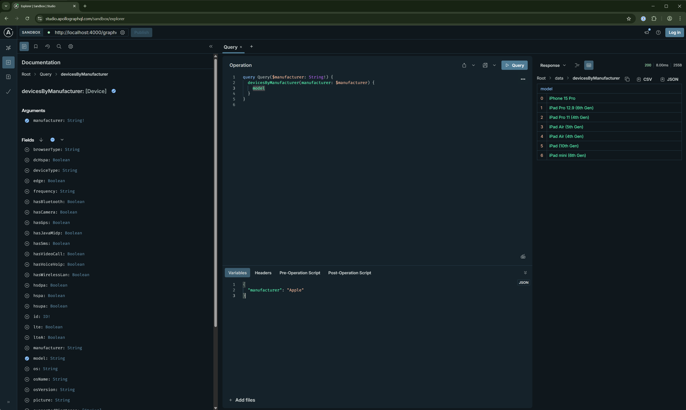

# Demonstration of Flogo using GraphQL

## Demonstrates simplicity of Flogo to implement various resolvers handling the following:

* Retrieve all devices
* Retrieve a device using ID
* Query for devices by manufacturer
* Query for devices by network capability
* Query for devices by well-known fields

## Pre-requisites

Make file uses calls to flogobuild tool. The flogobuild tool can be downloaded from edelivery.tibco.com under either TIBCO Flogo Enterprise or TIBCO Integration for TIBCO Platform.

| Make sure flogobuild is available on your environment path. 

You'll need to setup your context first. E.g.

```bash
flogobuild create-context -n latest -v /home/mmussett/flogo-vscode-linux-x64-1.3.0-1008.vsix --set-default
```

Whatever you decide to call your context, it needs to be the same as set in the FLOGO_CONTEXT variable in the Makefile, thus..

```
FLOGO_CONTEXT=latest
```

## Building the demo

A makefile (yeah i'm old but make works) is provided to build the Flogo Application and create the associated Docker Image.

Run make with the build target...
```bash
make build
```


## Starting the demo

1) Start MongoDB using Docker Compose.
2) Start Flogo Application using Docker Compose

```bash
docker compose -f ./db/docker-compose.yaml up
docker compose up -d
```

## Stopping the demo

Use Docker Compose to stop

```bash
docker compose down
docker compose -f ./db/docker-compose.yaml down
```


## About the GraphQL Endpoint

Our GraphQL endpoint is exposed on: http://localhost:4000/graphql


```graphql
type Device {
  # Basic device information
  id: ID!
  manufacturer: String
  model: String
  year: Int
  picture: String
  
  # Device type and screen
  deviceType: String
  touchScreen: Boolean
  
  # Operating system
  os: String
  osName: String
  osVersion: String
  
  # WAP and browser information
  wapStackVersion: String
  wapBrowserVersion: String
  uaProf: String
  browserType: String
  
  # Network connectivity
  frequency: String
  edge: Boolean
  umts: Boolean
  hsdpa: Boolean
  hsupa: Boolean
  hspa: Boolean
  dcHspa: Boolean
  lte: Boolean
  lteA: Boolean
  volte: Boolean
  wifiCalling: Boolean
  
  # Features
  supportedRingtones: [String]
  supportedVideoFormat: [String]
  hasCamera: Boolean
  hasVideoCall: Boolean
  hasVoiceVoip: Boolean
  hasBluetooth: Boolean
  hasWirelessLan: Boolean
  hasGps: Boolean
  hasJavaMidp: Boolean
  hasSms: Boolean
}

type Query {
  # Get a device by ID
  device(id: ID!): Device
  
  # Get all devices
  devices: [Device]
  
  # Search devices by various criteria
  searchDevices(
    manufacturer: String
    model: String
    year: Int
    deviceType: String
    hasCamera: Boolean
    hasTouchScreen: Boolean
    osName: String
  ): [Device]
  
  # Get devices by manufacturer
  devicesByManufacturer(manufacturer: String!): [Device]
  
  # Get devices by network capability
  devicesByNetworkCapability(
    lte: Boolean
    volte: Boolean
    wifiCalling: Boolean
  ): [Device]
}
```


## Using Apollo GraphQL Playground to test

Open a browser with the following URL https://studio.apollographql.com/sandbox/explorer/?

Endpoint exposed by API will be http://localhost:4000/graphql




### Schema




### Example Query to fetch all devices for a manufacturer

```graphql

{
  "manufacturer": "Apple"
}

query Query($manufacturer: String!) {
  devicesByManufacturer(manufacturer: $manufacturer) {
    model
  }
}
```

Results in the following

```json
{
  "data": {
    "devicesByManufacturer": [
      {
        "model": "iPhone 15 Pro"
      },
      {
        "model": "iPad Pro 12.9 (6th Gen)"
      },
      {
        "model": "iPad Pro 11 (4th Gen)"
      },
      {
        "model": "iPad Air (5th Gen)"
      },
      {
        "model": "iPad Air (4th Gen)"
      },
      {
        "model": "iPad (10th Gen)"
      },
      {
        "model": "iPad mini (6th Gen)"
      }
    ]
  }
}
```



