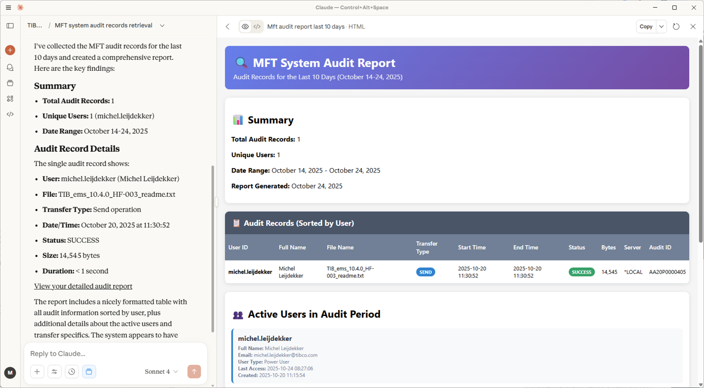
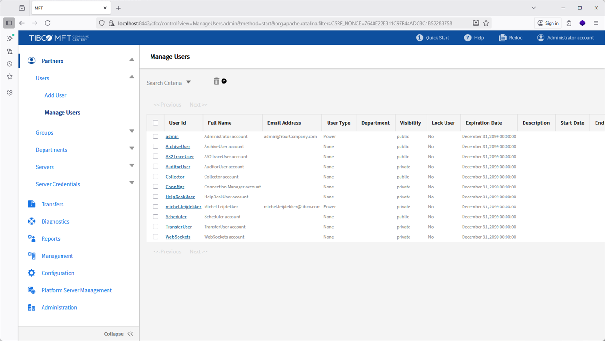
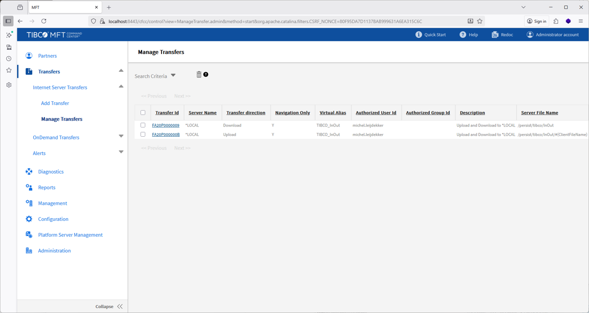
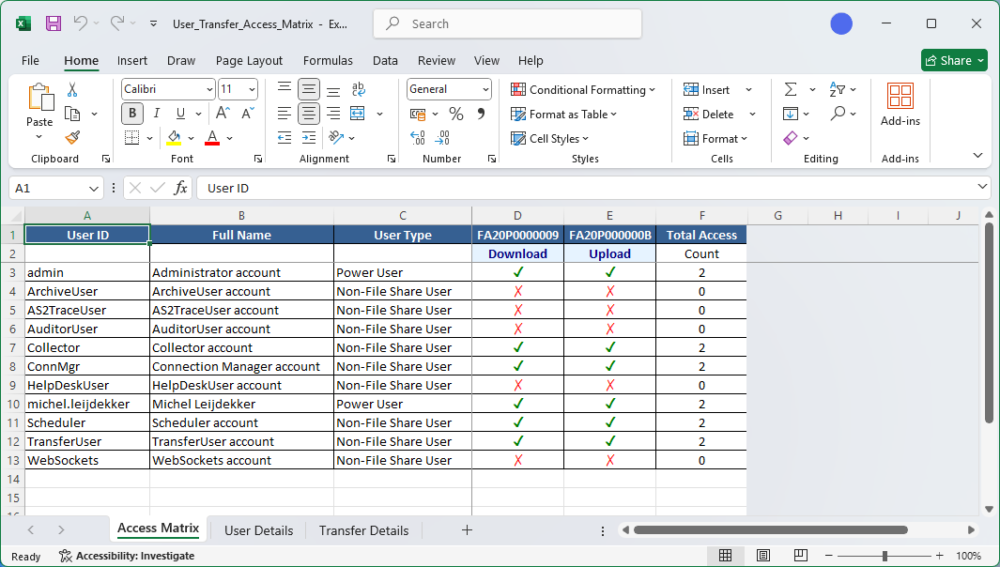
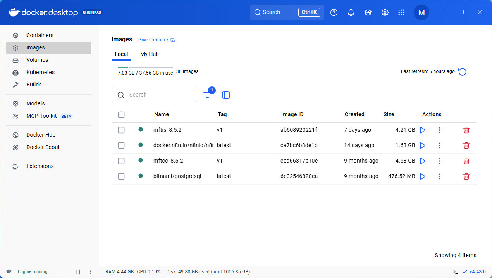
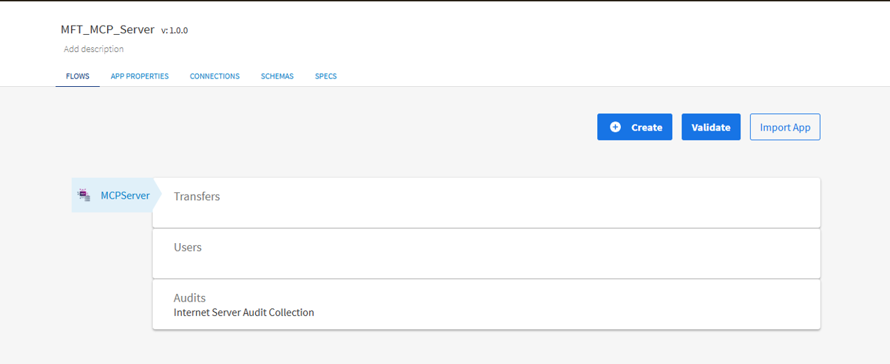
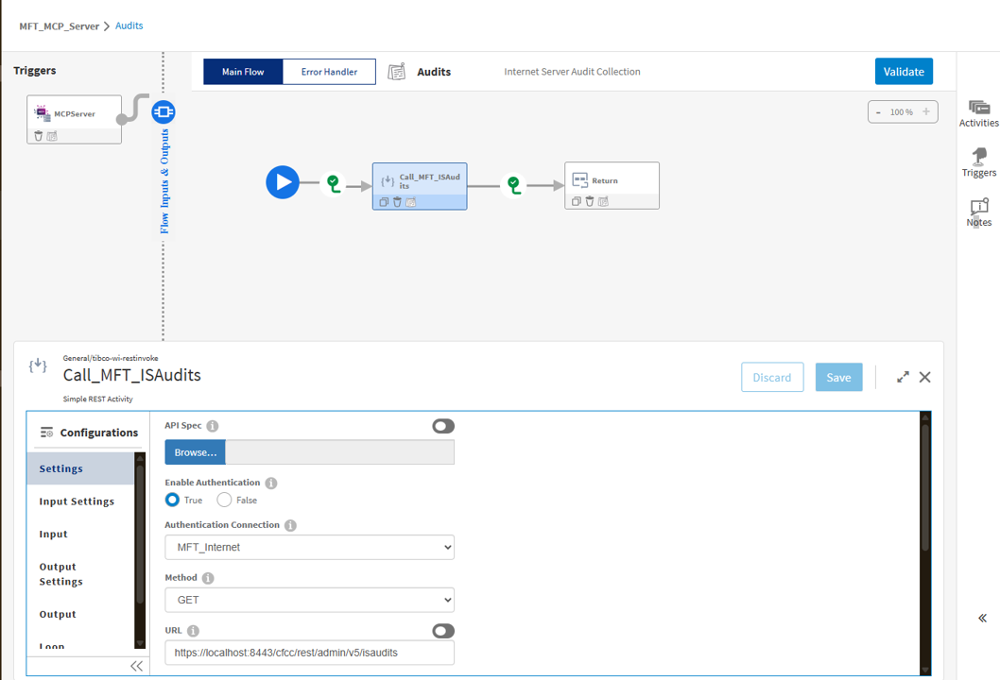
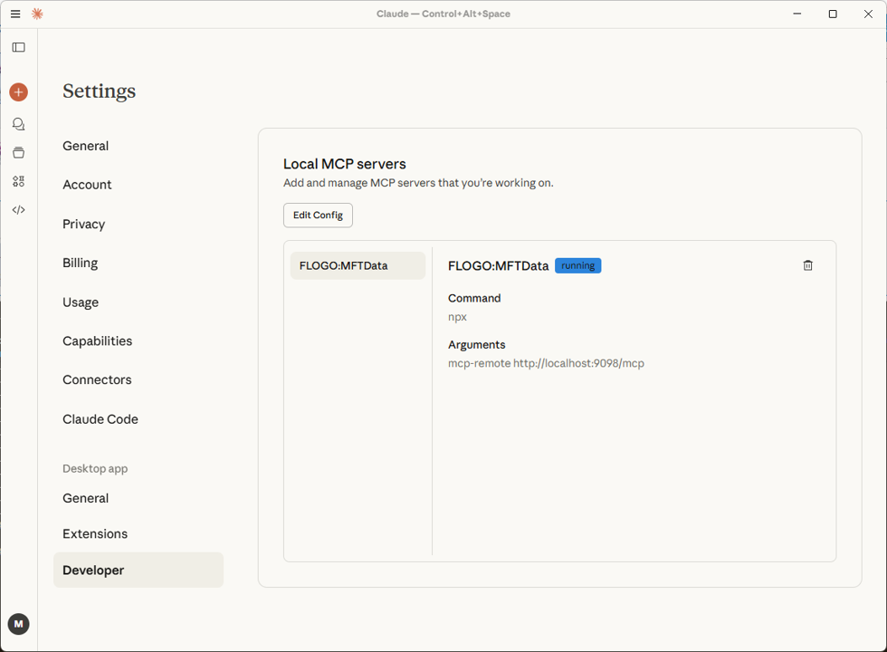
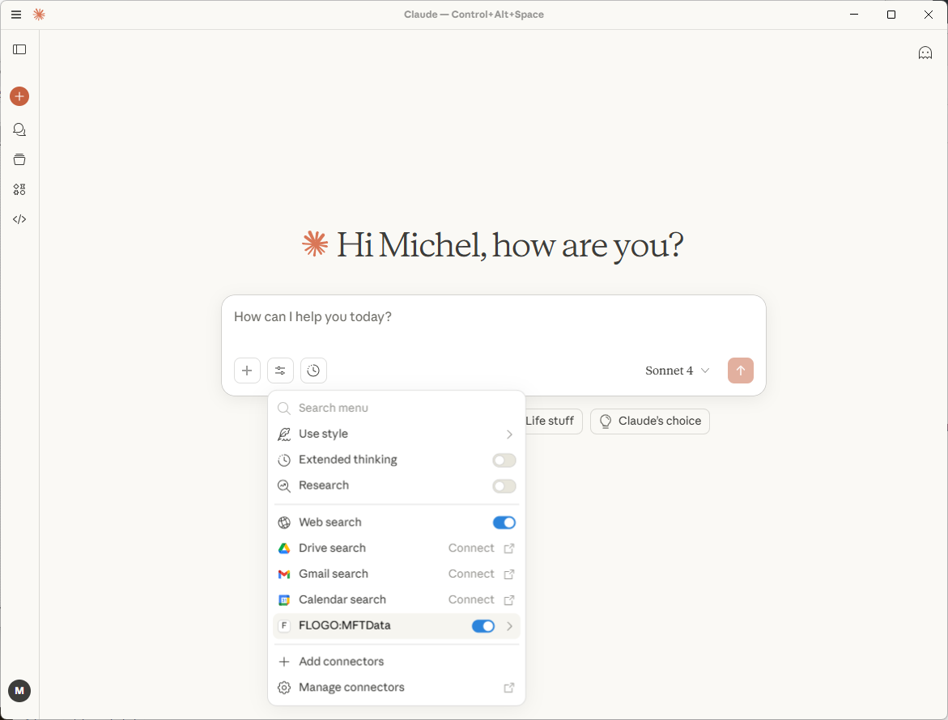

## Introduction

With **TIBCO Flogo®  Model Context Protocol (MCP) Connector**, enterprises can now expose their systems and business logic as **AI-accessible tools**, enabling secure, intelligent automation across CRM, order management, and communication systems — all **without writing code**.  

**TIBCO Managed File Transfer** provides a single point of control to manage all of your enterprise file transfers, both inside and outside the enterprise, with freedom of choice in deployment. MFT runs across all major platforms from Windows to the Mainframe or modern deployment options like **containers either on premise or in the cloud**.

This demo showcases how Flogo MCP Connector can turn a TIBCO Managed File Transfer system into **AI-powered B2B service experiences**.

## Demo Overview

In this demonstration, we build a **Managed File Transfer B2B AI agent** using the Flogo MCP Connector. It illustrates how the three MCP primitives — **Resources**, **Tools**, and **Prompts** — work together to connect AI models (like Claude, Open AI or other models) with enterprise data from the Managed File Transfer system in a controlled, compliant, and context-aware way.


## Use case: Audit Records retrieval

### Example : Claude Desktop

Prompt used:
```
Can you collect audit records from the MFT system of the last 10 days? The output should be a nice readable table of matrix sorted by user.
```

Output from Claude Desktop:




## Use case: Governance and Compliance








### Example : Claude Desktop

Prompt used:
```
I would like to know which users have access to which transfer. Can you create this overview for me? Please create a detailed mapping in a matrix for me.
```

Output from Claude Desktop:





## Getting started

### Prerequisites for building/running this demonstration:
- A running TIBCO MFT environment 
*I used a TIBCO MFT installation in a docker desktop environment running the [command center](https://docs.tibco.com/products/tibco-managed-file-transfer-command-center-8-6-0) and [internet server](https://docs.tibco.com/products/tibco-managed-file-transfer-internet-server) in a docker container.*


- Visual Code Studio with the Flogo Plugin
- Claude Desktop can be downloaded from the link below:  
   [https://claude.ai/download](https://claude.ai/download)
- Docker Desktop can be obtained from the link below:  
   [https://www.docker.com/products/docker-desktop/](https://www.docker.com/products/docker-desktop/)

#### Flogo MCP Server

The MCP Server is build in [TIBCO Flogo Enterprise](https://docs.tibco.com/products/tibco-flogo-enterprise).  Download the "TIBCO Flogo Extension for Visual Studio Code Software" from the [eDelivery portal](https://www.tibco.com/downloads/11810/secure/download-11810).

In the Flogo MCP Server multiple flows are defined. For each MCP - Tool definition a separate flow is specified. In this example MCP Server, there are 3 MCP Tool definitions available:
- Transfers Tool
- Users Tool
- Audits Tool



The MCP-Tool definition is the actual flow definition which is responsible for collecting the requested data to service the LLM models. In the example below an impression is shown of the Audits Tool flow definition. 




#### Claude Desktop Configuration

In the Claude Desktop configuration the Flogo MCP Server should be registered as a Local MCP Server. You will need to update the *claude_desktop_config.json* file with the following definitions.
Navigate to: >File >Settings >Developer and edit the file accordingly.

```
{
    "mcpServers": {
        "FLOGO:MFTData": {
            "command": "npx",
            "args": [
                "mcp-remote",
                "http://localhost:9098/mcp"
            ]
        }
    }
}

```


Navigate to: >File >Settings >Developer
In the configuration of the MCP Servers, you should be able to see the FLOGO MCP Server in the running status.




Navigate back to the Chat screen and click the "Search and Tools" button





### The materials to setup this demo is available on GitHub:  
[Flogo MCP Server on TIBCO Managed File Transfer](https://github.com/TIBCOSoftware/flogo-enterprise-hub/blob/master/demos/flogo_mcp_mft/README.md)


