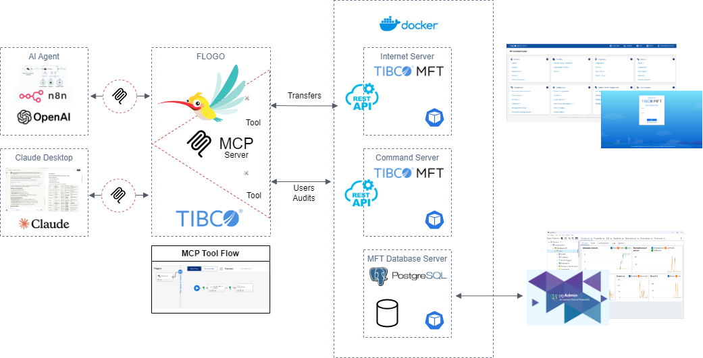

# MCP Server in FLOGO for TIBCO Managed File Transfer -  How to build

## Introduction

With **TIBCO Flogo®  Model Context Protocol (MCP) Connector**, enterprises can now expose their systems and business logic as **AI-accessible tools**, enabling secure, intelligent automation across CRM, order management, and communication systems — all **without writing code**.  

**TIBCO Managed File Transfer** provides a single point of control to manage all of your enterprise file transfers, both inside and outside the enterprise, with freedom of choice in deployment. MFT runs across all major platforms from Windows to the Mainframe or modern deployment options like **containers either on premise or in the cloud**.

This demo showcases how Flogo MCP Connector can turn a TIBCO Managed File Transfer system into **AI-powered B2B service experiences**.

## Demo Overview

 **In this demonstration, we build a **Managed File Transfer B2B AI agent** using the Flogo MCP Connector. It illustrates how the three MCP primitives — **Resources**, **Tools**, and **Prompts** — work together to connect AI models (like Claude or N8N with OpenAI model) with enterprise data from the Managed File Transfer system in a controlled, compliant, and context-aware way.

